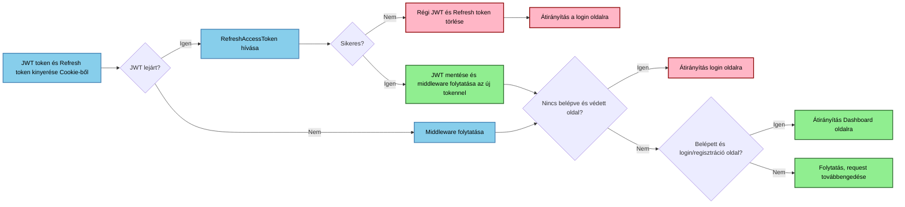
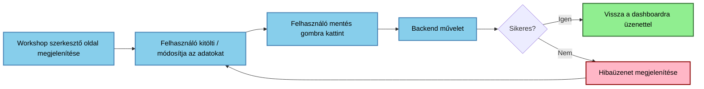
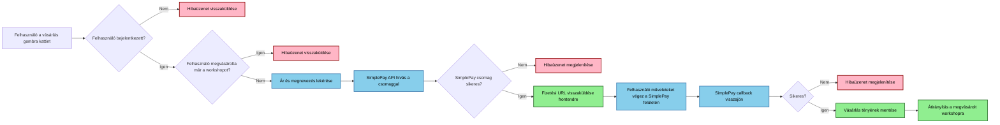

# Funkcionális specifikáció - Sastrugus workshop rendszer

|Paraméter  |Érték  |
|--|--|
|**Projekt neve**|Sastrugus online workshop  |
|**Dátum**|2025/2026 tanév őszi félév  |
|**Készítette**|Szabó István Keve (), Kovács Dániel (ADEJ1R)  |
|**Ötletgazda**|Szabó István Keve  |
|**Projektgazda**|Kovács Dániel  |
|**Backend**|Kovács Dániel  |
|**Frontend**|Szabó István Keve, Kovács Dániel  |
|**Manuális tesztelők**|Szabó István Keve, Kovács Dániel  |
|**Scrum Master**|Kovács Dániel (Szabó István Keve) |

## Bevezetés

Ez a dokumentum a Sastrugus online workshop / blueprint kezelő rendszer funkcionális működését írja le. Célja, hogy pontosan meghatározza, a rendszer milyen funkciókat biztosít, hogyan viselkedik a felhasználói interakciók során, és milyen adatokat kezel.

//TODO1 Redszeráttekintés

## Felhasználói felületek
### Bejelentkezési képernyő

**Mezők:**
 - Felhasználónév
 - jelszó

**Műveletek:**
- Bejelentkezés
	- Ha sikeres átriányítás a profil oldalra
	- Ha sikertelen, üzenet megjelenítése
- Hivatkozás a regisztrációs felületre
- Ha a felhasználó bejelentkezett, átirányítás a profil oldalra
- Kijelentkezés: Nincs önálló oldal vagy funkcionalitás, a megfelelő API hívásra automatikusan megtörténik

### Főmenü
**Műveletek:**

 - Navigálás az egyes oldalak között 
 - Folyamatosan látható be és
   kijelentkezés gomb, a felhasználó állapotától függően 
   Az aktuális
   oldal (vagy oldalkategória) kiemelten látható

//TODO2 Felhasználói felületek 

### Profil oldal
Az oldalon a felhasználó megtekintheti a saját workshopjait, létrehozhat újakat és szerkesztheti a meglévőket. Törlésre addig van mód, amíg a workshop nem prémium vagy prémium és nincs egyetlen előfizetője sem.
**Műveletek:** 
- Új workshop létrehozása
- Workshop szerkesztése
- Workshop törlése

### Workshop szerkesztő oldal
Workshopok létrehozása és szerkesztése
**Mezők:** 

 - Cím 
 - Kategória 
 - Rövid leírás 
 - Anyagszükséglet 
 - Lépsek leírása 
 - Videó link

**Műveletek:**
- Mentés
- Kilépés mentés nélkül

## Funkcionális folyamatok

//TODO3 Funkcionális folyamatok

### Prémium workshop megvásárlása

 1.  A bejelentkezett felhasználó a vásárlás gombra kattint a workshop oldalon
 2. A felhasználó átirányításra kerül a SimplePay felületére
 3. A felhasználó elvégzi a fizetést vagy visszalép
 4. A rendszer elemezi a fizetés állapotát
 5. Sikeres fizetés esetén megjeleníti a workshopot
 6. Sikertelen fizetés esetén hibaüzenet jelenik meg
 
 #### Backend logika:
 
 7. A fizetési kérelem beérkezésekor a backend lekérdezi a workshop állapotát
 8. Ha a backend nem prémium vagy a felhasználó nincs bejelentkezve, vagy bejelentkezett de már megvásárolta, hibaüzenetet küld vissza. Folyamat vége
 9. A backend felépíti a Simpleay csomagot, aláírja és elküldi a simplepay felé
 10. A kapott linket visszaküldi a frontrendnek, a frontend elvégzi a navigációt.
 11. A vásárlásból való visszatérés után elemzi a Simplepay választ
 12. A válasznak megfelelően, sikeres vásárlás után rögzíti a vásárlás tényét és megjeleníti a workshopot
 13. Vagy hibaüzenetet jelenít meg.  

## Adatmodell

### Workshop
| Mező neve| Mező típusa | Leírás| Követelmények / Megjegyzések |
| :--- | :--- | :--- | :--- |
| **`title`** | `string` | Cím | Kötelező, 20-200 karakter |
| **`description`** | `text` | Leírás | Kötelező |
| **`materialRequirement`** | `text` | Anyagszükséglet | Opcionális |
| **`steps`** | `text` | Lépések/Módszer | Kötelező |
| **`Decimal`** | `integer` | Egész szám | Opcionális |
| **`isPremium`** | `boolean` | Prémium | Kötelező |
| **`workshop_category`** | `relation` | Műhely kategória | Kapcsolat (sok az egyhez) |
| **`owner`** | `relation` | Tulajdonos | Kapcsolat (sok az egyhez) |

### Workshop kategória
| Mező neve | Mező típusa | Leírás | Követelmények / Megjegyzések |
| :--- | :--- | :--- | :--- |
| **`categoryName`** | `string` | Kategória neve | Opcionális. |
| **`categoryDescription`** | `text` | Kategória leírása | Opcionális. |
| **`workshops`** | `relation` | Műhelyek | Kapcsolat: egy a sokhoz (`oneToMany`) a `workshop` tartalomtípussal. |
| **`slug`** | `string` | SEO Cím / Egyedi URL rész | Kötelező és egyedi. |

//TODO 4 Adatmodell

## Folyamatleírások

//TODO 5 Folyamatleírások

### Védett oldalak és tokenek kezelése	

### Workshop létrehozása és módosítása	

### Prémium workshop megvásárlása

//TODO 6 Rendszerkövetelmények

## Elfogadási kritériumok
- Backend futtatható, workshop, workshop category működik (API level)
- Backend user Auth, Login, Token refresh működik (API level)
- Workshop és kategória schemak api-n keresztül lekérdezhetőek (core strapi funkcionalitás)
- Prémium workshop esetén nem jogosult felhasználó a lépéseket, videót, és az anyaglistát nem kapja meg a lekérdezésben (API nem küldi vissza, nem elég ha az UI elrejti)
- Nem prémium workshop nem vásárolható meg
- Vendég felhasználó és csak regisztrált nem küldhet be új workshopot
//TODO 7 elfogadási kritériumok

## Jövőbeni tervek
- Értékelések a workshopokhoz
- Workshopok moderálása
- Jutalék fizetés a workshop feltöltőknek a vásárlások után. (elszámolás, automata számlázás és kifizetés)
- Egyedi adatbázisok létrehozása vállalatoknak (white label)
- Egyedi adatbázisokon dolgozói hozzáférés például munkaterületen dolgozó munkatársnak, a munkafolyamatok pontos nyomorkövetésére. (Regisztráció nélkül, központi akár SSO megoldással)
- Egyedi adatbázisokon tudásfelmérés készítése

